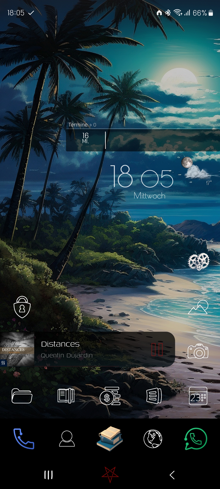

KWGT Widgets
===

A small collection of selfmade Widgets for the KWGT app for Android.

Free to use, change & share.

### Arrangement example

> The gray box below the CalendarFeedLine Widget is a [DigiCal](https://play.google.com/store/apps/details?id=com.digibites.calendarplus&hl=de&referrer=utm_source%3Dgoogle%26utm_medium%3Dorganic%26utm_term%3Ddigical&pcampaignid=APPU_1_iuYPZ9vHLuiL9u8PzrLN6Qc) Widget, which I can heavily recommend.

### Links
- [KWGT - Google Playstore](https://play.google.com/store/apps/dev?id=5300483087872269403)
- [KWGT Website](https://forum.kustom.rocks/)

